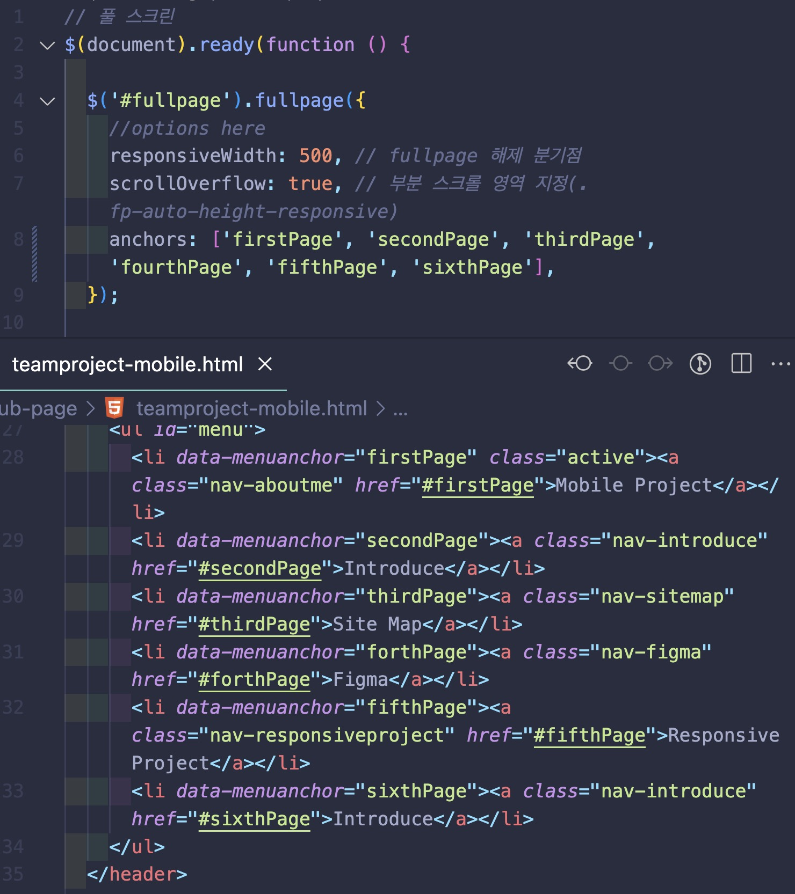
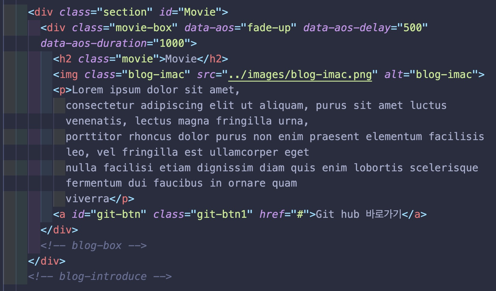
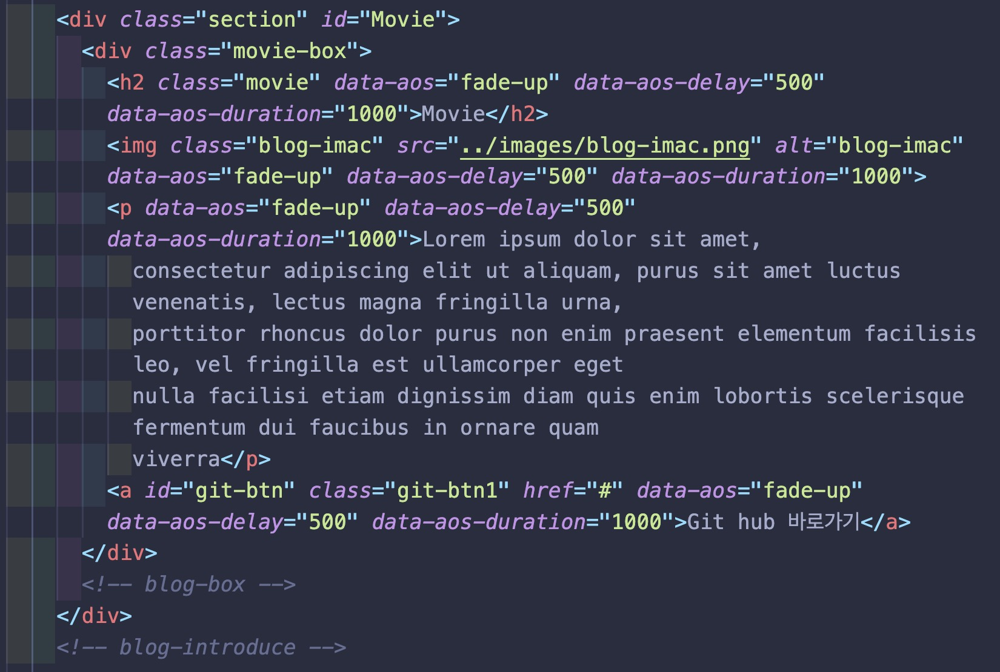

# portfolio

https://jun-isaac.github.io/portfolio/

-----------------
## 🧑🏻‍💻 구현 목표

- [x] 메뉴창에 마우스 오버시 메뉴 이름 나옴
- [x] 헤더 클릭시 그에 맞는 section으로 이동
- [ ] MBTI 스크롤 감지해서 그래프 작동
- [x] ability 메뉴 스크롤 감지해서 그래프 작동 / 버튼 누를시 동작으로 대체
- [x] 모바일에서 스크롤시 AOS 라이브러리 동작

-----------------
## 🖼 메인프레임

* 깔끔한 화이트 배경 가운데 COLOR-BOX들이 위치해 있는데 마우스를 올릴시에 메뉴명이 나타난다.   
마치 가장 좋아하는 물건을 구매해서 패키징을 열었을때 깔끔하고 가지런히 담겨있는 제품들을 보는 느낌을 선사해준다.   
그 안에는 무슨 제품들이 담겨 있을까 하는 궁금증은 덤.

------------------
## 💻 메인페이지

-------------------
## 

------------------
## 

------------------
## 📕 배운 것

*

------------------
## 🔨 수정해야 할 것

### ❌ 헤더 클릭 미동작 이슈

* 헤더 메뉴 클릭시 이동하지 않음
   

### 💡 해결

* html 클래스 이름과 js에서 설정한 이름이 달라서 동작하지 않았었음

    

### ❌ 모바일 하단 div AOS 이슈

* 가장 하단에 있는 div에 AOS 기능을 추가했을때 빠르게 스크롤을 내리면 하단에 공백이 생긴다.

  

### 💡 해결

* 하단 div에 AOS 기능을 주면 그 동작을 하는 동안 빈 공백이 생긴다.  
그렇다면 div에 주는 것이 아니라 내부 요소들에 일일히 준다면 어떻게 될까? 싶어서 적용해보았더니 해결이 되었다. 

* 이 방법으로 하면 해결이 되지만 코드가 좀 길어지게 되어서 조금 더 깔끔한 방법이 있지 않을까?  
조금 더 생각해 볼 필요가 있어 보인다.

    

### ❌ 수정 전 코드

 * div 전체에 AOS 기능을 넣었다.

  

### 💡 수정 후 코드

* div 내부 요소들에 AOS 기능을 넣었다.

 

----

### ❌ 하단 AOS 해결 되지 않음
* 데스크탑에서 본 모바일화면에서만 해결이 되었고 스마트폰으로 보면 해결이 되지 않았다.

### 💡 해결
* height 크기를 vh로 잡다보니 AOS랑 겹치면서 공백이 생긴듯 하다. height를 vh가 아닌 px로 고정해서 잡으니 문제가 해결 되었다.

## 사용 라이브러리
|jQuery|AOS|fullpage|
|---|---|---|
